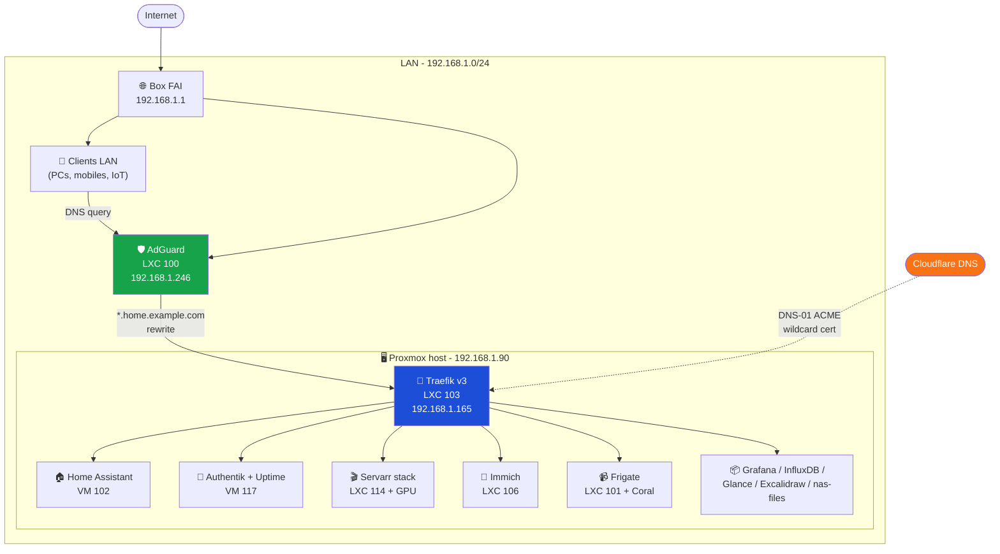
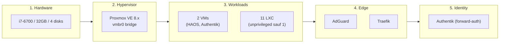

# 01 - Architecture

## Vue d'ensemble

Single-node Proxmox VE (8.x) sur un HP ATX recyclé. Tout en LAN, derrière la box FAI. Pas d'exposition internet.

## Couches logiques

> **Note** : Authentik est déployé mais le forward-auth Traefik n'est **pas encore activé** sur les routes - c'est dans la roadmap Phase 2 (voir [10-roadmap.md](10-roadmap.md)).

## Principes de design

- **LAN-only** : aucun service exposé sur internet. Si besoin externe → VPN (WireGuard / Tailscale, Phase 4).
- **DNS-01 wildcard** : un seul cert `*.home.example.com` pour tous les services. Renouvellement auto sans ouvrir le 80/443.
- **community-scripts par défaut** : la majorité des LXC viennent de [community-scripts/ProxmoxVE](https://github.com/community-scripts/ProxmoxVE).
- **Unprivileged LXC** quand possible (10/11 LXC le sont). Le seul privilégié est `frigate` à cause du passthrough iGPU + Coral.
- **Storage tiered** : système rapide (Kingston SSD), data chaude (Samsung T7 USB 1TB), data froide (Hitachi HDD 1TB), backups (Samsung T5 USB 250GB).

## Flux d'une requête HTTPS

Exemple : un client LAN tape `https://immich.home.example.com` :

1. Client interroge AdGuard (192.168.1.246) via DHCP-pushed DNS
2. AdGuard a une rewrite rule `*.home.example.com → 192.168.1.165` → renvoie cette IP
3. Client ouvre TLS sur 192.168.1.165:443 (Traefik LXC 103)
4. Traefik présente le wildcard cert Let's Encrypt (validé par les CAs publics)
5. Traefik route via le `Host:` header vers `http://192.168.1.134:2283` (Immich LXC 106)
6. Réponse remonte le chemin inverse

## Single-Point-of-Failure connus

| SPOF | Impact | Mitigation actuelle | Mitigation future |
|------|--------|---------------------|-------------------|
| Proxmox host | tout le lab down | hardware mono | Phase 6 : 2nd node + cluster |
| AdGuard | aucune résolution `.home.example.com` | reboot rapide (10G LXC) | Phase 3 : AdGuard secondary |
| Traefik | toutes les URLs HTTPS down | reboot rapide (2G LXC) | acceptable, fallback IP:port direct possible |
| Box FAI | aucun DHCP, aucun internet | accepter | hors-scope |
| Kingston SSD système | tout le lab down | vzdump + backups | Phase 6 : ZFS mirror |
