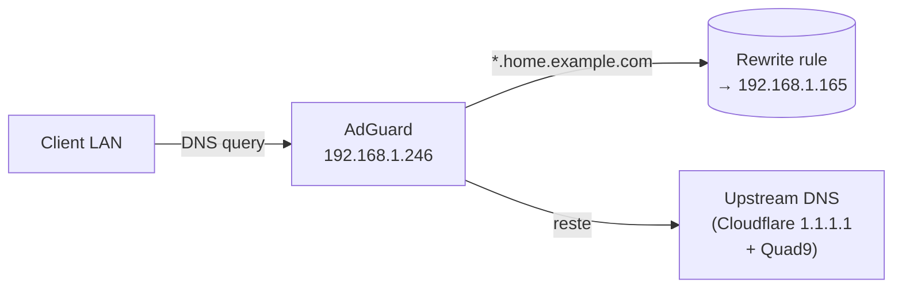

# 03 - Network

> Mis à jour le **2026-05-05** avec l'export DHCP complet du UCG Ultra.

## Topologie physique (couche 1-2)

```
Internet (fibre Bouygues)
    │
[Bouygues Bbox Lite]  ← 192.168.2.28 (WAN ISP)
    │  Ethernet WAN
[UniFi Cloud Gateway Ultra]  ← 192.168.1.1 (LAN gateway + DHCP)
    │   │   │   │  (ports LAN RJ45)
  PVE  PC  Deco  autres appareils filaires
               │
         [Deco X55 #1]  ← mesh WiFi backhaul
               │ (WiFi 802.11ax)
         [Deco X55 #2]  + tous les clients WiFi
```

> **Double NAT** : la Bbox Lite tourne en mode routeur (pas en bridge). Le UCG Ultra voit l'IP `192.168.2.x` sur son WAN et fait du NAT vers le subnet `192.168.1.0/24`. Conséquence : les ports entrants nécessitent un port-forward sur la Bbox ET sur le UCG.

> **Aucun switch managé** pour l'instant : tous les appareils filaires tombent directement sur les ports LAN du UCG Ultra. VLANs planifiés Phase 5.

## Plan d'adressage

| Range | Usage |
|-------|-------|
| `192.168.2.0/24` | Réseau Bouygues (WAN du UCG) |
| `192.168.1.0/24` | LAN home - subnet unique |
| `192.168.1.1` | **UCG Ultra** (gateway + DHCP) |
| `192.168.1.2 → .49` | Réservé infra fixe |
| `192.168.1.50 → .89` | Statique homelab |
| `192.168.1.90` | **Proxmox host** |
| `192.168.1.100 → .199` | Pool DHCP - VMs/LXC homelab |
| `192.168.1.200 → .249` | Réservations critiques |
| `192.168.1.246` | **AdGuard** (LXC 100) |
| `192.168.1.165` | **Traefik** (LXC 103) |
| `192.168.1.250 → .254` | Mgmt / scratch |

## Bridge réseau Proxmox

`vmbr0` est le seul bridge - pont vers l'interface physique (`eno1`). Tous les LXC/VMs y sont attachés.

```
auto lo
iface lo inet loopback

iface eno1 inet manual

auto vmbr0
iface vmbr0 inet static
    address 192.168.1.90/24
    gateway 192.168.1.1
    bridge-ports eno1
    bridge-stp off
    bridge-fd 0
```

## DNS

### Architecture DNS



### Configuration AdGuard

- **Listen** : 192.168.1.246:53 (TCP/UDP)
- **Admin UI** : http://192.168.1.246:80 → exposé via Traefik à `https://dns.home.example.com`
- **Upstream** : Cloudflare 1.1.1.1 / 1.0.0.1 + Quad9 9.9.9.9 (DoT activé)
- **Filtres** : OISD Big, AdGuard DNS filter, EasyPrivacy

### Rewrite wildcard

```
Domain: *.home.example.com
Answer: 192.168.1.165
```

Pas besoin d'ajouter une entrée par service. Quand on ajoute un nouveau service à Traefik, il est immédiatement résolvable.

### DNS direct (fallback sans AdGuard)

```
192.168.1.165 immich.home.example.com grafana.home.example.com pve.home.example.com ...
```

## DHCP

DHCP est servi par le **UniFi Cloud Gateway Ultra** (`192.168.1.1`), pas par la box FAI.

### Export DHCP complet - 2026-05-05

#### Proxmox / Homelab (préfixe MAC `BC:24:11:*`)

| MAC | IP | Hostname | Type | Service |
|-----|----|----------|------|---------|
| `02:00:00:00:00:11` | 192.168.1.246 | adguard | Fixed | LXC 100 - DNS |
| `02:00:00:00:00:14` | 192.168.1.80 | frigate | Dynamic | LXC 101 - NVR |
| `02:00:00:00:00:01` | 192.168.1.128 | homeassistant | Dynamic | VM 102 - HAOS |
| `02:00:00:00:00:1c` | 192.168.1.165 | traefik | Dynamic | LXC 103 - RP |
| `02:00:00:00:00:17` | 192.168.1.134 | immich | - | LXC 106 - Photos |
| `02:00:00:00:00:15` | 192.168.1.94 | influxdb | - | LXC 107 - TSDB |
| `02:00:00:00:00:16` | 192.168.1.85 | grafana | - | LXC 108 - Dashboards |
| `02:00:00:00:00:12` | 192.168.1.76 | glance | - | LXC 111 - Dashboard |
| `02:00:00:00:00:19` | 192.168.1.78 | excalidraw | - | LXC 113 - Diagrammes |
| `02:00:00:00:00:18` | 192.168.1.88 | servarr | - | LXC 114 - Media |
| `02:00:00:00:00:13` | 192.168.1.195 | nas-files | - | LXC 115 - Files |
| `02:00:00:00:00:10` | 192.168.1.175 | nginxproxymanager | Fixed | LXC 110 ⚠️ stopped |
| `02:00:00:00:00:1b` | 192.168.1.181 | authentik | - | VM 117 - IdP |
| `02:00:00:00:00:1d` | 192.168.1.252 | coolify | Fixed | VM 300 - PaaS |
| `02:00:00:00:00:1a` | 192.168.1.86 | ubuntu | Dynamic | ❓ inconnu - voir note |

> ⚠️ **`ubuntu` (MAC 02:00:00:00:00:1a, IP .86)** : LXC/VM Proxmox non référencé dans l'inventaire. À identifier (`pct list` / `qm list`).

#### Réseau WiFi Mesh

| MAC | IP | Hostname | Type | Appareil |
|-----|----|----------|------|---------|
| `02:00:00:00:00:0c` | 192.168.1.31 | deco-X55 | Fixed | Deco X55 #1 (principal, câblé UCG) |
| `02:00:00:00:00:0d` | 192.168.1.35 | deco-X55 | Fixed | Deco X55 #2 (satellite, mesh WiFi) |
| `02:00:00:00:00:26` | 192.168.1.54 | espressif | Fixed | ESP32 / IoT (labellisé "Deco X55" par erreur) |

#### Appareils personnels

| MAC | IP | Hostname | Type | Appareil |
|-----|----|----------|------|---------|
| `02:00:00:00:00:02` | 192.168.1.118 | - | Dynamic | Apple Mac Studio |
| `02:00:00:00:00:20` | 192.168.1.250 | - | Dynamic | Apple Laptop |
| `02:00:00:00:00:0b` | 192.168.1.182 | iPhone | Dynamic | iPhone |
| `02:00:00:00:00:05` | 192.168.1.129 | WIN | Dynamic | PC/Laptop Windows |
| `02:00:00:00:00:21` | 192.168.1.180 | remote | Dynamic | Accès distant (appareil inconnu) |
| `02:00:00:00:00:06` | 192.168.1.168 | Chambre | Dynamic | Appareil chambre |
| `02:00:00:00:00:0a` | 192.168.1.33 | Chambre-2 | Fixed | Appareil chambre 2 (câblé?) |
| `02:00:00:00:00:0f` | 192.168.1.100 | DESKTOP-O43GQP4 | Fixed | **PC Bureau** (câblé) |
| `02:00:00:00:00:03` | 192.168.1.194 | Apple-TV-Salon | Fixed | **Apple TV Salon** (câblé) |

#### Multimédia & Gaming

| MAC | IP | Hostname | Type | Appareil |
|-----|----|----------|------|---------|
| `02:00:00:00:00:25` | 192.168.1.156 | - | Dynamic | Nintendo Switch OLED |
| `02:00:00:00:00:04` | 192.168.1.48 | - | Dynamic | Nintendo Wii U |

#### IoT & Domotique

| MAC | IP | Hostname | Type | Appareil |
|-----|----|----------|------|---------|
| `02:00:00:00:00:27` | 192.168.1.108 | ecb5fa2f3e38 | Fixed | **Philips Hue Bridge** (câblé) |
| `02:00:00:00:00:1f` | 192.168.1.22 | HueSyncBox | Fixed | Philips Hue Sync Box |
| `02:00:00:00:00:22` | 192.168.1.58 | velux | Fixed | Velux gateway |
| `02:00:00:00:00:1e` | 192.168.1.211 | sonnette | Fixed | Sonnette / doorbell |
| `02:00:00:00:00:08` | 192.168.1.190 | Presence-Sensor-FP2-3A4D | Fixed | **Aqara Presence Sensor FP2** |
| `02:00:00:00:00:0e` | 192.168.1.96 | roborock-vacuum-a73 | Fixed | **Roborock** aspirateur robot |
| `02:00:00:00:00:23` | 192.168.1.151 | P110 | Fixed | TP-Link Tapo P110 prise #1 |
| `02:00:00:00:00:24` | 192.168.1.226 | P110 | Fixed | TP-Link Tapo P110 prise #2 |
| `02:00:00:00:00:28` | 192.168.1.132 | P110 | Fixed | TP-Link Tapo P110 prise #3 |
| `02:00:00:00:00:07` | 192.168.1.191 | wlan0 | Dynamic | Linux (RPi?) - interface wlan0 |

#### Imprimantes & Équipements

| MAC | IP | Hostname | Type | Appareil |
|-----|----|----------|------|---------|
| `02:00:00:00:00:09` | 192.168.1.83 | EPSON3D1AB0 | Dynamic | **Imprimante Epson** (WiFi) |
| `02:00:00:00:00:29` | 192.168.1.154 | K1-DDFA | Fixed | **Creality K1** imprimante 3D |

## Configuration des clients (DNS LAN)

Pour que `*.home.example.com` résolve correctement : configurer le UCG Ultra pour pousser AdGuard (`192.168.1.246`) comme DNS primaire via DHCP. Tous les clients en profitent automatiquement.

> ⚠️ Si un client a un DNS hardcodé (DoH browser-level, etc.), `*.home.example.com` ne résoudra **pas**. C'est attendu - la résolution est purement LAN.

## Ports ouverts (host PVE)

| Port | Service | Listen |
|------|---------|--------|
| 8006/tcp | Proxmox web UI | `0.0.0.0` (accédé via `pve.home.example.com`) |
| 22/tcp | SSH | `0.0.0.0` (à restreindre - voir [09-hardening.md](09-hardening.md)) |
| 5404-5405/udp | Corosync | non utilisé (single-node) |
| 60000-65000/tcp | KVM live-migration | non utilisé (single-node) |

Les services applicatifs écoutent sur leurs LXC respectifs, **pas** sur le host. Voir [docs/06-services.md](06-services.md).

## Pas de VLAN actuellement

Tout est sur un seul broadcast domain. Roadmap Phase 5 : segmenter en VLANs (mgmt / IoT / DMZ / users).
