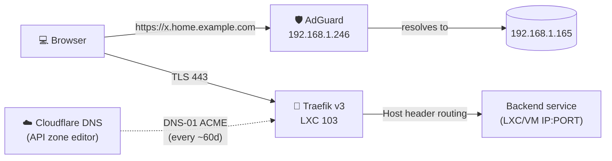

# 05 - Reverse Proxy & DNS

## Stack



## Composant 1 - AdGuard (DNS)

**LXC 100, IP `192.168.1.246`**

Sert deux rôles :
1. **Filtrage DNS** pour tout le LAN (pubs, trackers)
2. **DNS rewrite** pour résoudre `*.home.example.com` vers Traefik

### La règle wildcard

Une seule rewrite :
```
Domain: *.home.example.com
Answer: 192.168.1.165
```

C'est tout. Quand on ajoute un nouveau service à Traefik, **rien à toucher côté DNS**.

### Upstream

Cloudflare DoT + Quad9 DoT (configurer via UI ou config file).

### Backups

AdGuard config = `/opt/AdGuardHome/AdGuardHome.yaml`. Inclus dans le vzdump du LXC 100 (cf. [07-backups.md](07-backups.md)). Pour exporter à part :
```bash
pct exec 100 -- cat /opt/AdGuardHome/AdGuardHome.yaml > configs/adguard/AdGuardHome.yaml
```

> ⚠️ Le YAML AdGuard contient des hashes bcrypt de mots de passe. **Sanitize avant commit** (voir `configs/adguard/AdGuardHome.example.yaml`).

## Composant 2 - Traefik (reverse proxy)

**LXC 103, IP `192.168.1.165`**

Version : Traefik v3.x (community-script `traefik`).

### Layout des fichiers

```
/etc/traefik/
├── traefik.yaml           # config statique (entrypoints, providers, ACME)
├── conf.d/                # config dynamique (file provider, watched)
│   ├── admin.yml          # pve, traefik dashboard, authentik, uptime kuma
│   ├── data.yml           # immich, grafana, influxdb, adguard, file, excalidraw
│   ├── home.yml           # homeassistant
│   └── media.yml          # jellyfin, *arr, jellyseerr
└── ssl/
    └── acme.json          # storage Let's Encrypt (chmod 600, NE PAS committer)
```

Configs source : voir [`configs/traefik/`](../configs/traefik/).

### Entrypoints

| Name | Address | Rôle |
|------|---------|------|
| `web` | `:80` | Redirige tout vers `websecure` (HSTS implicite) |
| `websecure` | `:443` | TLS terminé ici, présente le wildcard cert |
| `traefik` | `127.0.0.1:8080` | Métriques + API internes (pas exposé) |

### Cert resolver `cloudflare`

```yaml
certificatesResolvers:
  cloudflare:
    acme:
      email: contact@home.example.com
      storage: /etc/traefik/ssl/acme.json
      dnsChallenge:
        provider: cloudflare
        delayBeforeCheck: 30
        resolvers:
          - "1.1.1.1:53"
          - "1.0.0.1:53"
```

### Variables d'environnement (pour Cloudflare)

Traefik a besoin de **CF_DNS_API_TOKEN** (token scoped `Zone:DNS:Edit + Zone:Read` sur la zone `home.example.com` uniquement).

Stocké dans `/etc/traefik/cloudflare.env` (chmod 600) :
```
CF_DNS_API_TOKEN=<REDACTED>
```

Chargé par Traefik via systemd override :
```
/etc/systemd/system/traefik.service.d/override.conf
```
qui inclut `EnvironmentFile=/etc/traefik/cloudflare.env`.

Pour obtenir/régénérer le token : Cloudflare → My Profile → API Tokens → Custom token avec :
- Permissions : `Zone : DNS : Edit`
- Zone resources : `Include : Specific zone : home.example.com`

> 🔒 Le token n'est **jamais committé**. Stockez-le hors du repo (ex. Bitwarden, sops, age, ou simplement `chmod 600 ~/.secrets.env`).

### Compte Let's Encrypt

- **Endpoint** : `acme-v02.api.letsencrypt.org/acme/acct/3303949445`
- **Email** : `contact@home.example.com`
- **Key size** : 4096 bits
- **CA** : Let's Encrypt R12 intermediate (au moment de l'émission)
- **Validité cert** : 90 jours, auto-renew ~30j avant expiration

### Wildcard cert

Le cert wildcard est défini sur l'entrypoint :
```yaml
websecure:
  http:
    tls:
      certResolver: cloudflare
      domains:
        - main: home.example.com
          sans:
            - "*.home.example.com"
```

→ Un **seul** cert pour tout. Renouvelé automatiquement ~30j avant expiration.

### Routes

17 routes au total, regroupées par usage dans `conf.d/` :

| Group file | Routes |
|------------|--------|
| `admin.yml` | pve, traefik (dashboard), authentik, uptime |
| `data.yml` | immich, grafana, influxdb, adguard (UI via `dns.home.example.com`), file, excalidraw |
| `home.yml` | homeassistant |
| `media.yml` | jellyfin, radarr, sonarr, lidarr, bazarr, jellyseerr |

Format type :
```yaml
http:
  routers:
    immich:
      rule: "Host(`immich.home.example.com`)"
      entryPoints: [websecure]
      service: immich
      tls:
        certResolver: cloudflare
        domains:
          - main: home.example.com
            sans: ["*.home.example.com"]

  services:
    immich:
      loadBalancer:
        servers:
          - url: "http://192.168.1.134:2283"
```

Cas spéciaux :
- **PVE** (UI Proxmox) : backend HTTPS self-signed → utilise `serversTransports: insecure` qui active `insecureSkipVerify: true` (acceptable car LAN-only).
- **Authentik** : pareil, backend HTTPS self-signed.

### Logs

```
/var/log/traefik/traefik.log        # JSON, level INFO
/var/log/traefik/traefik-access.log # JSON access log
```

Filtré pour ne logger que statuses `200` et `400-599`. Logrotation à vérifier.

### Dashboard

`https://traefik.home.example.com` → API + dashboard `api@internal`. **Pas d'auth** actuellement (à corriger Phase 2 via Authentik forward-auth).

## Hot reload

Le file provider est en `watch: true`. **Modifier un fichier dans `conf.d/` → Traefik reload automatique en quelques secondes**, pas de restart nécessaire.

Vérifier qu'un changement est pris en compte :
```bash
pct exec 103 -- journalctl -u traefik -n 30 --no-pager
```

## Diagnostic

| Symptôme | Vérifier |
|----------|----------|
| Cert "self-signed" dans browser | acme.json mal généré → `pct exec 103 -- cat /etc/traefik/ssl/acme.json` doit être JSON valide non-vide |
| `404 page not found` Traefik | Host header pas matché → vérifier `Host(...)` dans la route |
| `Bad gateway` | backend down → vérifier le LXC cible + port |
| Cert pas renouvelé | erreur DNS-01 → vérifier `CF_DNS_API_TOKEN` + logs Traefik |
| AdGuard ne résout pas `*.home.example.com` | rewrite supprimée → recréer dans UI AdGuard |

## Migration NPM → Traefik (mai 2026)

L'ancien reverse proxy était Nginx Proxy Manager (LXC 110). Migrés en une session :
- Génération wildcard cert via DNS-01 (vs HTTP-01 par-host avant)
- Plus simple à étendre (1 fichier YAML par groupe vs UI clic-clic)
- File provider permet de versionner les routes dans Git

Le LXC 110 est **stopped** mais conservé temporairement comme rollback. À archiver après période de validation (~1 mois sans incident).
