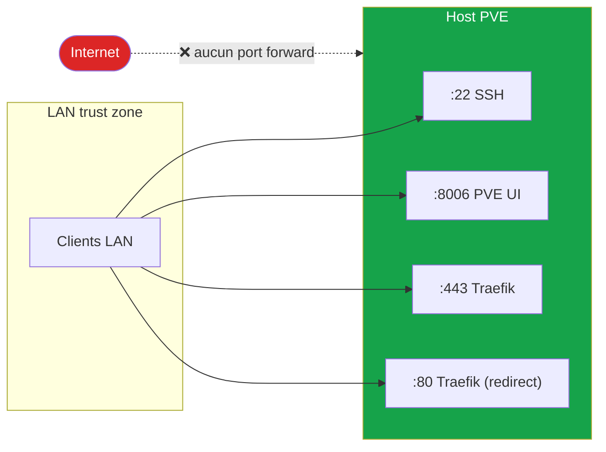

# 09 - Hardening

> Document vivant - coche au fur et à mesure.

## Phase 1 - Baseline (en cours)

### ✅ Acquis

- [x] **Reverse proxy unique** : tout le trafic HTTPS passe par Traefik
- [x] **Wildcard cert TLS** : Let's Encrypt DNS-01 Cloudflare, auto-renew
- [x] **DNS interne** : AdGuard avec filtrage pubs/trackers
- [x] **LXC unprivileged** : 10/11 LXC en unprivileged (le seul privilégié est Frigate à cause des passthroughs)
- [x] **Backups quotidiens** : vzdump auto sur SSD séparé (T5)
- [x] **Snapshot HAOS** : double couche backup pour HAOS
- [x] **Pas d'exposition internet** : LAN-only, aucune ouverture port côté box FAI
- [x] **API token Cloudflare scopé** : token limité à `Zone:DNS:Edit` sur `home.example.com` uniquement (pas global)

### ⚠️ Partiel

- [ ] **Restore tests** : aucun restore automatique testé. → script à écrire
- [ ] **DHCP reservations** : seuls AdGuard/Traefik sont réservés ; le reste tourne en DHCP volatile
- [ ] **IPs fixes** : LXC 101 (frigate), VM 102 (HAOS) en DHCP - fragile
- [ ] **`startup: order=N`** : seule la VM 102 a un order défini ; les autres dépendances ne sont pas explicites

### ❌ À faire (Phase 1.5)

- [ ] **SSH host hardening**
  - [ ] `PermitRootLogin prohibit-password`
  - [ ] `PasswordAuthentication no`
  - [ ] Ajouter clé SSH ed25519 (depuis admin laptop)
  - [ ] `AllowUsers root` (puis créer utilisateur `admin` non-root + sudo)
- [ ] **2FA Proxmox UI** : activer TOTP sur le user `root@pam` et tout futur user
- [ ] **Pare-feu Proxmox** : activer `firewall: 1` au niveau Datacenter, créer rules pour bloquer tout sauf 22/8006 du LAN
- [ ] **Authentik forward-auth** : middleware Traefik pour protéger
  - [ ] `traefik.home.example.com` (dashboard)
  - [ ] `dns.home.example.com` (AdGuard UI)
  - [ ] `pve.home.example.com` (déjà protégé par PVE auth, mais 2nd layer = défense en profondeur)
  - [ ] Tous les *arr (Radarr/Sonarr/Lidarr/Bazarr)
- [ ] **Logging centralisé** : Loki + Promtail pour collecter logs des LXC
- [ ] **SMART monitoring auto** : cron hebdo + alerte Uptime Kuma si dégradation
- [ ] **Update strategy** : doc `runbooks/proxmox-update.md` + planifier maintenance window mensuelle
- [ ] **Secrets manager** : envisager `pass` ou Bitwarden pour stocker les secrets (au lieu de fichiers `.env` dispersés)
- [ ] **Audit annuel** : checklist CIS Proxmox / Debian appliquée

## Surface d'exposition

**Aucune ouverture sortante côté box FAI**. Le seul flux entrant depuis Internet est l'API Cloudflare en réponse aux DNS-01 challenges (sortant Traefik → Cloudflare).

## Compte rendu Phase 1

| Domaine | Score perçu | Justification |
|---------|-------------|---------------|
| Réseau (perimeter) | 🟢 9/10 | LAN-only, pas d'expo |
| Réseau (interne) | 🟡 5/10 | Pas de VLAN, pas de firewall PVE actif |
| Authentification | 🟡 4/10 | PVE root + mots de passe simples sur certains services. 2FA absent partout sauf HAOS |
| Backups | 🟡 6/10 | Quotidien OK, mais pas off-site, pas de restore tests |
| Updates | 🔴 3/10 | Pas de cadence définie, dette accumulée |
| Logging / monitoring | 🟡 5/10 | Uptime Kuma OK, mais logs LXC pas centralisés |
| Secrets | 🟡 5/10 | Cloudflare token bien scopé, mais reste éparpillé en config files |

→ Cible Phase 2 : tout en 🟢 sauf Updates (atteindre 🟡 honnête).

## Anti-patterns identifiés à corriger

1. **Mots de passe partagés** : risque que certains services réutilisent le même mdp admin → audit lors de l'activation Authentik
2. **Bind mounts globaux** : `/mnt/usbssd/data` shared entre LXC 114 et 115. UID mapping unprivileged identique → OK pour l'instant, mais documenter pour ne pas casser
3. **`insecureSkipVerify: true`** sur PVE et Authentik backends Traefik : acceptable LAN-only, à reconsidérer si on un jour ouvre vers Tailscale/WG
4. **Aucune segmentation** : un LXC compromis a accès au LAN entier, y compris à la box FAI
5. **`onboot: 0` sur NPM (110)** : OK, mais à archiver/supprimer pour ne pas semer la confusion
6. **🔴 Pool LVM-thin sur-provisionné à 321%** : 374 GB alloués sur 141 GB physiques. Cause probable du crash HAOS du 4 mai 2026. → cf. [04-storage.md](04-storage.md), mitigation Phase 5 (ZFS mirror)
7. **HDD Hitachi 35846h power-on** : ~4 ans d'usage continu. SMART OK aujourd'hui mais à surveiller, et planifier remplacement (Phase 5 - migration ZFS sur SSD)

## Liens utiles

- Best practices Proxmox : https://pve.proxmox.com/wiki/Security
- Proxmox firewall : https://pve.proxmox.com/wiki/Firewall
- Authentik Traefik forward-auth : https://docs.goauthentik.io/docs/providers/proxy/server_traefik
