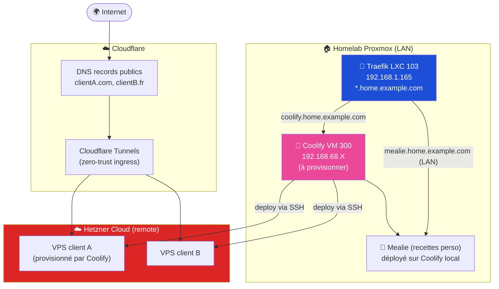

# 11 - Coolify (self-hosted) + projets clients

> **Status** : ✅ **Opérationnel** depuis 2026-05-05. VM 300 + Coolify 4.0.0 + GitHub App + Hetzner CX23 + tunnel CF actif. 1ère app déployée : portfolio example.com en test sur `https://test.home.example.com` (LAN-only, server `localhost`).

## Objectifs

1. **Self-host Coolify** sur Proxmox pour orchestrer les déploiements applicatifs (PaaS-like)
2. **Héberger des projets clients** sur des VPS Hetzner Cloud, pilotés par le Coolify local
3. **Séparer clean** infra perso (Traefik LXC 103 LAN-only) de l'hébergement client (Coolify + Cloudflare Tunnel)

## Architecture cible



### Décisions architecturales prises

| Décision | Choix | Rationale |
|----------|-------|-----------|
| Topologie reverse proxy | **Architecture B** : Traefik LXC 103 (LAN home.example.com) **et** Coolify Traefik interne (sites clients via CF Tunnel) | Sépare lab perso vs hébergement client. Pas de mélange routes. |
| OS Coolify VM | Ubuntu 24.04 LTS cloud image (`noble-server-cloudimg-amd64.img`) | Officiellement supporté par Coolify, image cloud minimale |
| Resources Coolify VM | 4 vCPU / 8 GB RAM / 80 GB disk | Confortable pour orchestration + quelques apps locales |
| Storage VM | `usbssd` (T7 Shield 1TB) | SSD rapide + sain (304 G libres au moment du choix) |
| Méthode install | **Manuelle** | Le community-script `coolify-vm.sh` n'a pas été testé/validé |
| VPS client | Hetzner Cloud (intégration native Coolify) | Datacenters EU, prix bas, API mature, billing simple |
| Ingress public | Cloudflare Tunnel | Pas de port forward Freebox, zero-trust, DDoS-protected |

## Coolify local - provisioning VM 300

### Spec cible

```
VMID:    300
Name:    coolify
OS:      Ubuntu 24.04 LTS cloud image
vCPU:    4
RAM:     8 GB
Disk:    80 GB sur usbssd
Network: vmbr0, IP 192.168.1.252 (réservation Fixed UCG Ultra, MAC 02:00:00:00:00:1d)
Cloud-init: SSH keys (RSA + ed25519), pas de mot de passe
Boot:    OVMF (UEFI) + vga: std (NOT serial0 - voir lessons learned)
```

### Installation

Voir [`runbooks/coolify-install.md`](../runbooks/coolify-install.md) - procédure pas-à-pas avec les pièges connus.

Post-install :

```bash
# Sur la VM Coolify
curl -fsSL https://cdn.coollabs.io/coolify/install.sh | sudo bash
```

### Route Traefik

Après install, exposer l'UI Coolify sur le LAN :

`/etc/traefik/conf.d/coolify.yml` :

```yaml
http:
  routers:
    coolify:
      rule: "Host(`coolify.home.example.com`)"
      entryPoints: [websecure]
      service: coolify
      tls:
        certResolver: cloudflare
        domains:
          - main: home.example.com
            sans: ["*.home.example.com"]

  services:
    coolify:
      loadBalancer:
        servers:
          - url: "http://192.168.1.252:8000"
```

> Suivre [`runbooks/add-new-service.md`](../runbooks/add-new-service.md) pour les détails.

## Projets clients sur Hetzner

### Modèle d'hébergement

1. **Provisionnement** : depuis l'UI Coolify, ajouter un "Server" Hetzner via API token Hetzner Cloud
2. **Déploiement** : push Git vers Coolify → build → deploy SSH sur le VPS Hetzner cible
3. **Ingress** : Cloudflare Tunnel installé sur le VPS, point d'entrée pour le domaine client
4. **DNS** : record CNAME du domaine client → URL du tunnel Cloudflare
5. **TLS** : géré par Cloudflare automatiquement (cert edge) + interne via Coolify Traefik si besoin

### Étapes pour onboarder un client

```
1. Création VPS Hetzner via Coolify (CX22 ou plus selon charge)
2. Cloudflare Tunnel : créer un tunnel dédié pour le client
3. Setup DNS Cloudflare (zone du client) → CNAME vers <tunnel>.cfargotunnel.com
4. Connecter le repo Git du projet à Coolify
5. Configurer build + deploy automatique sur push main
6. Ajouter monitoring Uptime Kuma → check du domaine client
7. Documenter dans un fichier interne (hors repo) : access, billing, SLA
```

### Budgétisation type

| Ressource | Coût mensuel estimé |
|-----------|---------------------|
| VPS Hetzner CX22 (mutualisé pour 3-5 petits sites) | ~5€ |
| VPS Hetzner CX32 (1 client moyen) | ~10€ |
| Cloudflare (Free plan) | 0€ |
| Domaine .com / .fr | ~1€/mois (annualisé) |

→ Marge confortable même sur un petit site client à 30-50€/mois.

## Sécurité

- **API tokens** (Hetzner, Cloudflare, Git) : stockés dans Coolify (chiffrés au repos), **JAMAIS** dans ce repo
- **SSH keys** vers les VPS : générées par Coolify, root sur le VPS
- **Backups VPS** : snapshots Hetzner (option payante ~20% du coût VPS) + dump DB régulier vers le Proxmox local via rsync/restic
- **Isolation client** : 1 VPS = 1 client si données sensibles ; mutualisé sinon
- **Audit logs** : Coolify journalise les déploiements ; conserver

## Lien avec le reste du lab

- **Uptime Kuma** (VM 117) : ajouter monitor pour chaque domaine client
- **Grafana** (LXC 108) : dashboard Coolify (via API ou Prometheus exporter - Phase 5)
- **Backups B2** (Phase 4) : inclure les dumps VPS clients

## État actuel (2026-05-05)

- ✅ VM 300 + Coolify 4.0.0 + cloudflared tunnel
- ✅ GitHub App enregistrée (id `3612700`, install id `129792007`) sur `youruser/portfolio`
- ✅ Hetzner CX23 `hetzner-shared-1` provisionné (dispo pour les futurs sites clients ou bascule prod portfolio)
- ✅ App test `my-portfolio` déployée sur server `localhost`, joignable LAN-only via `https://test.home.example.com`
- ⏳ Bascule prod `example.com` vers Hetzner après validation test LAN
- ⏳ Premier client onboardé (TBD)
- ⏳ Runbook `runbooks/onboard-client.md`

## Pattern de déploiement perso (localhost LAN-only)

Pour tout projet perso à déployer sur la VM 300 avec un sous-domaine `*.home.example.com` :

1. **Coolify** : New Resource → Application → GitHub App → repo + branch + base directory + Dockerfile
2. **FQDN dans Coolify** : `http://<sub>.home.example.com` (HTTP, pas HTTPS - sinon coolify-proxy tente Let's Encrypt qui échoue LAN-only)
3. **Traefik LXC 103** : ajouter un router dans `configs/traefik/coolify-apps.yml` pointant vers le service `coolify-apps` (déjà défini, forwarde vers `https://192.168.1.252:443` avec `insecureSkipVerify`)
4. AdGuard wildcard `*.home.example.com → .165` reste en place - le routing fonctionne automatiquement
5. Push code → GitHub webhook → CF Tunnel → Coolify → rebuild + rolling update

## Pattern de déploiement client/serieux (Hetzner public)

Pour un site client à exposer sur internet via son propre domaine :

1. **Coolify** : New Resource → Application → server `hetzner-shared-1` (au lieu de localhost)
2. **FQDN** : `https://<client-domain>.com`
3. **Cloudflare Tunnel** propre au site client (à provisionner) - expose la zone DNS du client vers ce VPS
4. **DNS** : zone Cloudflare du client → CNAME vers le tunnel `cfargotunnel.com`
5. **TLS** : auto-géré par Cloudflare edge (universal SSL)

## Reliquats / TODO

- [ ] Documenter le runbook `runbooks/deploy-perso-app.md` (process complet pas-à-pas)
- [ ] Documenter le runbook `runbooks/onboard-client.md` (Hetzner + CF tunnel + DNS)
- [ ] Whitelist UA `coolify-helper` dans le `proxy.ts` du portfolio si le healthcheck Coolify retourne 403
- [ ] Décider stratégie cert pour les apps Coolify localhost - option B : configurer DNS-01 sur coolify-proxy avec API token Cloudflare pour avoir un cert valide direct (élimine le `insecureSkipVerify`)

## Références

- Coolify docs : https://coolify.io/docs
- Coolify GitHub : https://github.com/coollabsio/coolify
- Hetzner Cloud API : https://docs.hetzner.cloud/
- Cloudflare Tunnels : https://developers.cloudflare.com/cloudflare-one/connections/connect-networks/
