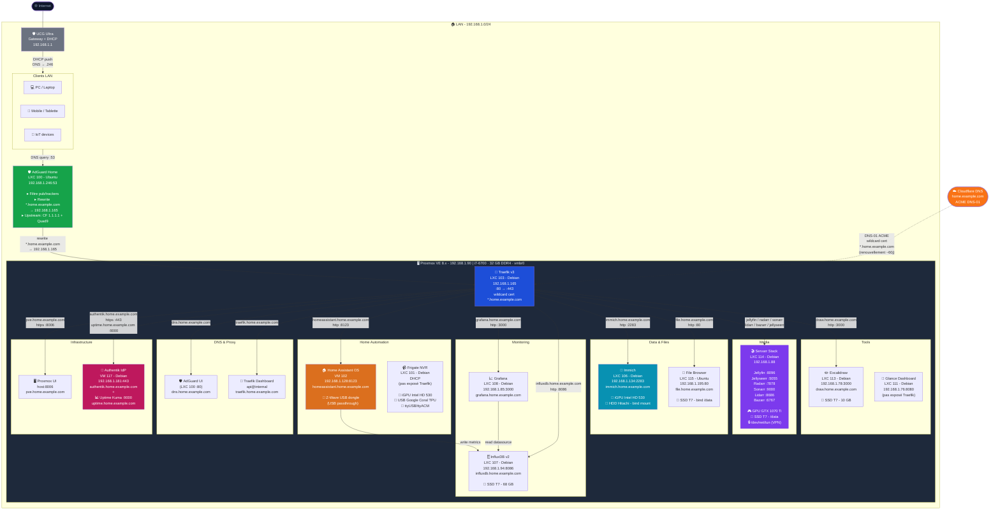
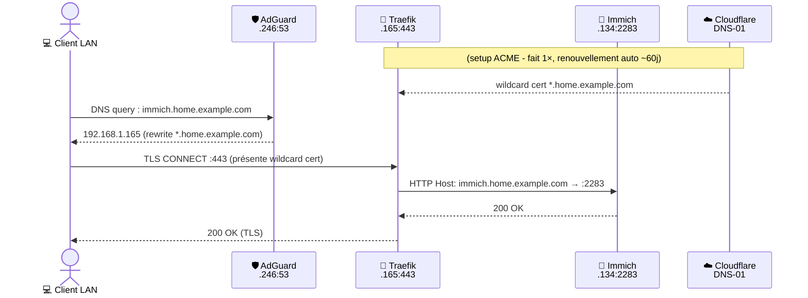
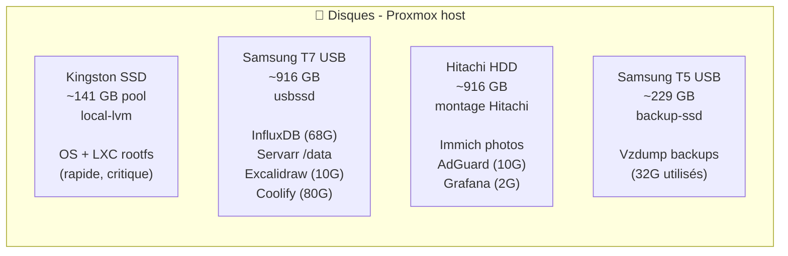

# 13 - Network Diagram

> Mis à jour le **2026-05-05** avec l'export DHCP UCG Ultra (32 devices). Source de vérité : [02-inventory.md](02-inventory.md) + [03-network.md](03-network.md) + [06-services.md](06-services.md).

---

## 📐 Diagramme draw.io (topologie physique + câbles)

Fichier importable dans [app.diagrams.net](https://app.diagrams.net) :

**[→ docs/assets/network-diagram.drawio](assets/network-diagram.drawio)**

> **Ouvrir** : `app.diagrams.net` → **File → Import from → Device** → sélectionner le fichier `.drawio`

Ce diagramme contient :
- Couche physique : Internet → Bbox Lite → UCG Ultra → Proxmox / Deco X55 / appareils filaires
- Zone WiFi mesh (Deco X55 #1 câblé + #2 satellite) avec tous les clients
- Tous les LXC/VMs Proxmox dans leur conteneur
- Légende couleurs (infra / IoT / perso / équipements)

---

## Topologie physique (synthèse)

```
🌐 Internet (fibre Bouygues)
    │
📡 Bouygues Bbox Lite - 192.168.2.28
    │  Ethernet WAN (double NAT)
🛡️ UCG Ultra - 192.168.1.1 (gateway + DHCP server)
    │   │     │        │         │
    │   │     │        │    autres filaires
    │  PVE   Deco X55 #1   (PC .100, Apple TV .194,
    │  .90   .31 (câblé)    Hue Bridge .108, Velux .58,
    │         │              HueSyncBox .22, K1 .154, sonnette .211)
    │    WiFi mesh ↗
    │   Deco X55 #2 (.35)
    │    +
    │    WiFi clients (Mac Studio .118, iPhone .182,
    │    Apple Laptop .250, WIN .129, Nintendo .156/.48,
    │    Roborock .96, P110 x3, Aqara FP2, EPSON .83, …)
    │
🖥️ Proxmox VE - 192.168.1.90
   ├── LXC 100 adguard       .246
   ├── LXC 101 frigate        .80
   ├── VM  102 HAOS           .128
   ├── LXC 103 traefik        .165
   ├── LXC 106 immich         .134
   ├── LXC 107 influxdb       .94
   ├── LXC 108 grafana        .85
   ├── LXC 111 glance         .76
   ├── LXC 113 excalidraw     .78
   ├── LXC 114 servarr        .88
   ├── LXC 115 nas-files      .195
   ├── VM  117 authentik      .181
   ├── VM  300 coolify        .252
   └── LXC 110 nginxproxy     .175 ⚠️ stopped
```

---

## Vue réseau logique (services)



---

## Flux d'une requête HTTPS (exemple : Immich)



---

## Plan d'adressage

| Plage | Usage |
|-------|-------|
| `192.168.1.1` | Box FAI (gateway + DHCP) |
| `192.168.1.2 - .49` | Réservé infra fixe (futur) |
| `192.168.1.50 - .89` | Statique homelab |
| `192.168.1.90` | **Proxmox host** |
| `192.168.1.100 - .199` | Pool DHCP VMs/LXC |
| `192.168.1.200 - .249` | Réservations critiques |
| `192.168.1.246` | **AdGuard** (DNS, LXC 100) |
| `192.168.1.165` | **Traefik** (RP, LXC 103) |
| `192.168.1.250 - .254` | Mgmt / scratch |

---

## Stockage (host PVE)



---

## Hardware passthrough

| LXC/VM | Device | Usage |
|--------|--------|-------|
| LXC 101 (Frigate) | iGPU Intel HD 530 (`/dev/dri/*`) | Décodage HW vidéo |
| LXC 101 (Frigate) | USB Google Coral TPU | Object detection ML |
| LXC 101 (Frigate) | `/dev/ttyUSB*`, `/dev/ttyACM*` | Capteurs série |
| LXC 106 (Immich) | iGPU Intel HD 530 (`/dev/dri/*`) | ML smart search / faces |
| LXC 114 (Servarr) | NVIDIA GTX 1070 Ti (`/dev/nvidia*`) | Transcode Jellyfin NVENC |
| LXC 114 (Servarr) | `/dev/net/tun` | Client VPN (downloads) |
| VM 102 (HAOS) | USB Z-Wave/Zigbee dongle (`host=1-1`) | Domotique |

---

## Liens

- [01-architecture.md](01-architecture.md) - vue logique
- [02-inventory.md](02-inventory.md) - inventaire complet LXC/VMs
- [03-network.md](03-network.md) - plan d'adressage + DNS
- [05-reverse-proxy.md](05-reverse-proxy.md) - Traefik config
- [06-services.md](06-services.md) - routes + détails services
